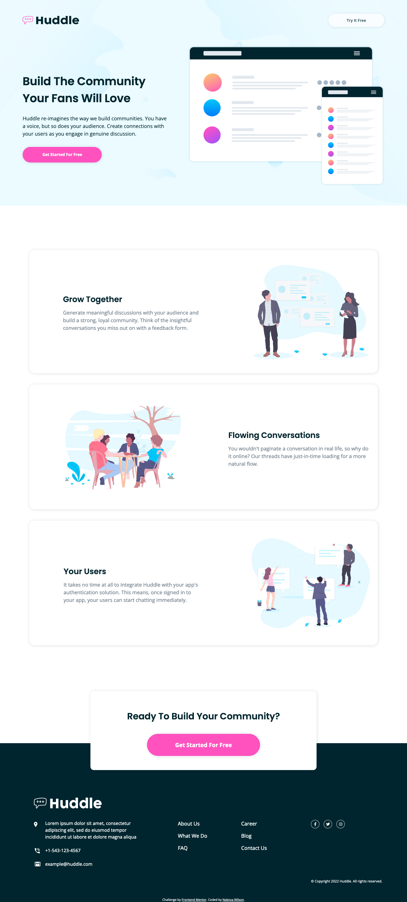

# Frontend Mentor - Huddle landing page with alternating feature blocks solution

This is a solution to the [Huddle landing page with alternating feature blocks challenge on Frontend Mentor](https://www.frontendmentor.io/challenges/huddle-landing-page-with-alternating-feature-blocks-5ca5f5981e82137ec91a5100). Frontend Mentor challenges help you improve your coding skills by building realistic projects.

## Table of contents

- [Overview](#overview)
  - [The challenge](#the-challenge)
  - [Screenshot](#screenshot)
  - [Links](#links)
- [My process](#my-process)
  - [Built with](#built-with)
  - [Useful resources](#useful-resources)
- [Author](#author)

**Note: Delete this note and update the table of contents based on what sections you keep.**

## Overview

### The challenge

Users should be able to:

- View the optimal layout for the site depending on their device's screen size
- See hover states for all interactive elements on the page

### Screenshot

### Links

- Solution URL: [https://nakoyawilson.github.io/huddle-landing-page-with-alternating-feature-blocks/](https://nakoyawilson.github.io/huddle-landing-page-with-alternating-feature-blocks/)
- Live Site URL: [https://github.com/nakoyawilson/huddle-landing-page-with-alternating-feature-blocks](https://github.com/nakoyawilson/huddle-landing-page-with-alternating-feature-blocks)

## My process

### Built with

- HTML
- CSS
- Mobile-first workflow

### Useful resources

- [How to center align font awesome icons vertically in a circle div? - Stack Overflow](https://stackoverflow.com/a/20832403)

## Author

- Website - [Nakoya Wilson](https://nakoyawilson.netlify.app/)
- Frontend Mentor - [@nakoyawilson](https://www.frontendmentor.io/profile/nakoyawilson)
- Twitter - [@nakoyawilson](https://twitter.com/nakoyawilson)
- LinkedIn - [@nakoyawilson](https://www.linkedin.com/in/nakoyawilson/)
